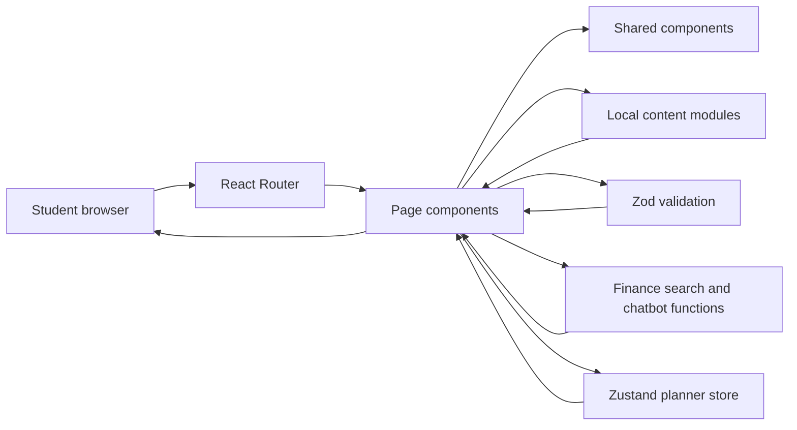
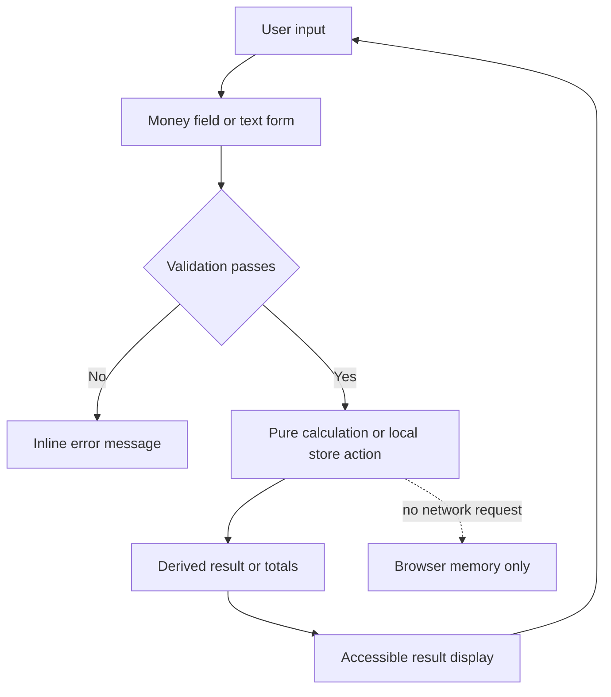
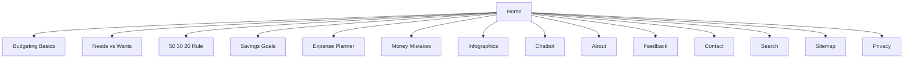
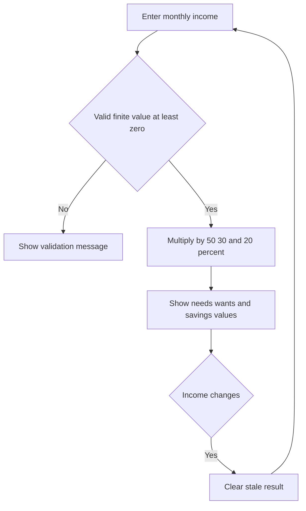
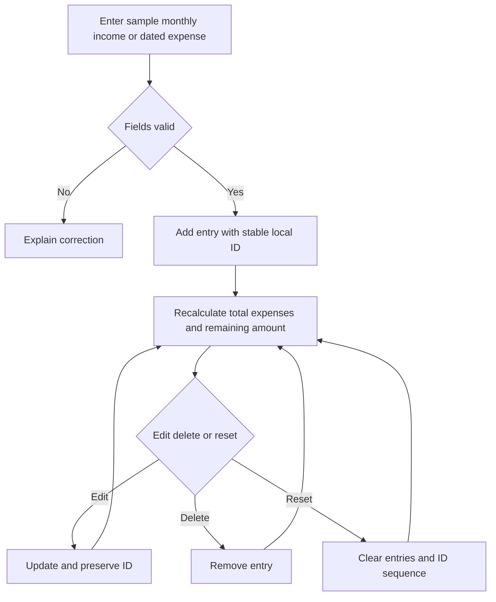

# BudgetBasics Project Report

## Executive summary

BudgetBasics is a responsive, frontend-only learning website that helps students understand everyday personal finance and practise what they learn. Educational content ships with the app, calculators run locally, and planner entries remain temporary browser state. The application covers twelve primary destinations plus search, sitemap, privacy, and fallback routes.

## Problem definition

Students often meet budgeting terms before they have a practical way to connect them to real choices. Static explanations do not show how income becomes category limits, how long a savings goal may take, or how repeated expenses affect a balance. BudgetBasics addresses this gap with short explanations, student examples, immediate feedback, and small calculation tools.

The intended users are students and first-time budgeters. They need plain language, keyboard-usable interactions, clear validation, no registration barrier, and examples that can be explored without exposing real financial data.

## Objectives and scope

The project explains income, expenses, needs, wants, and savings; provides practice activities; calculates a 50/30/20 allocation and savings timeline; manages a temporary expense plan; and offers money-mistake guidance, infographics, search, and prepared chatbot responses. Supporting pages cover the project, feedback, contact, privacy, and sitemap.

Authentication, payments, bank connections, persistent storage, server-side form delivery, personalised financial advice, and generative chatbot answers are outside the scope.

## Design approach

A shared application shell keeps navigation, footer links, local time, and responsive behaviour consistent. Page heroes establish purpose; cards and progressive disclosure keep learning material scannable. Interactive forms show validation near the relevant inputs. Reusable components cover money fields, charts, notices, and activities without introducing another component framework.

Accessibility features represented in the implementation and tests include semantic headings, labels, keyboard-operable controls, active navigation state, a responsive menu, reduced-motion handling for back-to-top behaviour, and explanatory feedback rather than colour alone.

## Architecture

BudgetBasics is a Vite single-page application built with React. React Router maps URLs to page components. JavaScript and JSON modules provide navigation, learning content, infographics, and chatbot responses. Zod validates form input. Pure finance functions calculate results. Zustand manages the temporary expense planner. Vitest, Testing Library, and jsdom exercise logic and rendered behaviour.

## Data flow

## Sitemap

| Route | Purpose |
| --- | --- |
| `/` | Overview and entry points |
| `/budgeting-basics` | Six core concepts and knowledge check |
| `/needs-vs-wants` | Classification activity with reasoning |
| `/50-30-20` | Suggested needs, wants, and savings allocation |
| `/savings-goals` | Remaining amount, progress, and time estimate |
| `/expense-planner` | Temporary income and expense planning |
| `/money-mistakes` | Scenarios, consequences, actions, and prevention |
| `/infographics` | Searchable visual learning cards |
| `/chatbot` | Prepared answers selected from local keywords |
| `/about`, `/feedback`, `/contact` | Project and local-form support pages |
| `/search`, `/sitemap`, `/privacy` | Discovery, route index, and privacy explanation |

## Main workflows

## Data, privacy, and rules

No user database or remote API is used. Learning records are bundled source files. Calculator values and planner entries are processed locally. Planner state is not persisted. Feedback and contact forms demonstrate validation and completion but do not submit to a server.

- Money values must be finite and non-negative; selected targets and entry amounts must be positive.
- The budget calculator returns 50% needs, 30% wants, and 20% savings.
- Savings remaining never falls below zero; months round up; a zero contribution gives no completion estimate for an incomplete goal.
- Expense totals sum entries and identify overspending when the balance is negative.
- Feedback rating is an integer from 1 to 5; required text is trimmed and bounded where appropriate.

Representative inputs are in `test-data.json`.

## Testing and actual results

The automated suite covers finance, validation, search, chatbot routing, planner state, navigation, accessible controls, calculators, learning activities, expense planning, and support pages. Detailed cases and final command outcomes are recorded in `test-cases.txt`.

The authoritative commands are `bun run test`, `bun run lint`, and `bun run build`. Browser-level smoke is recorded only when a browser tool is available. No Lighthouse result is claimed.

## Installation and structure

Install Bun 1.3 or newer, run `bun install`, then `bun run dev`. Source is grouped into `src/components`, `src/data`, `src/lib`, `src/pages`, `src/store`, and `src/test`; public assets live in `public`; submission material lives in `documentation`. The Word installation guide is `documentation/ReadMe.docx`.

## Static deployment

Run `bun run build` and publish `dist/` to a static host. Configure unknown routes to serve `index.html` so direct React Router URLs work. Full examples and checks are in `DEPLOYMENT.md`.

## Assumptions and limitations

- Examples use SAR, while calculation logic is currency-neutral.
- The audience is a student learner, not a professional finance customer.
- The 50/30/20 rule is a learning guideline, not advice.
- Users should enter sample values because information is not saved.
- Current evergreen browsers with JavaScript enabled are assumed.
- The chatbot is deterministic and limited to prepared topics.
- Direct static routes require a host rewrite rule.

## AI tools acknowledgment

AI-assisted coding and documentation tools supported implementation, test design, review, and document preparation. Human review remains necessary for financial wording, submission requirements, deployment configuration, recorded demonstrations, and final acceptance.

## Submission status

Source, documentation, test evidence, and a Word installation guide are included. An MP4 has not been recorded or claimed. Recording the supplied `VIDEO_WALKTHROUGH_SCRIPT.md` remains a manual deliverable.
